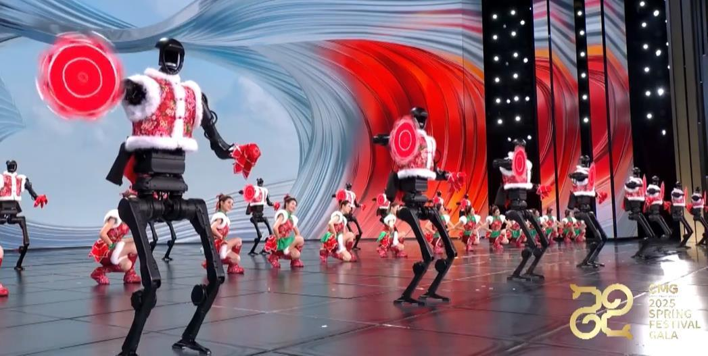

# Natural Humanoid Motion

How do robots achieve natural-looking humanoid locomotion?
<video src="../videos/robotera.mp4" controls muted class="w-50"></video>

::right::

<v-click>

DeepMimic: Use motion capture data to guide RL-based motion

</v-click> 